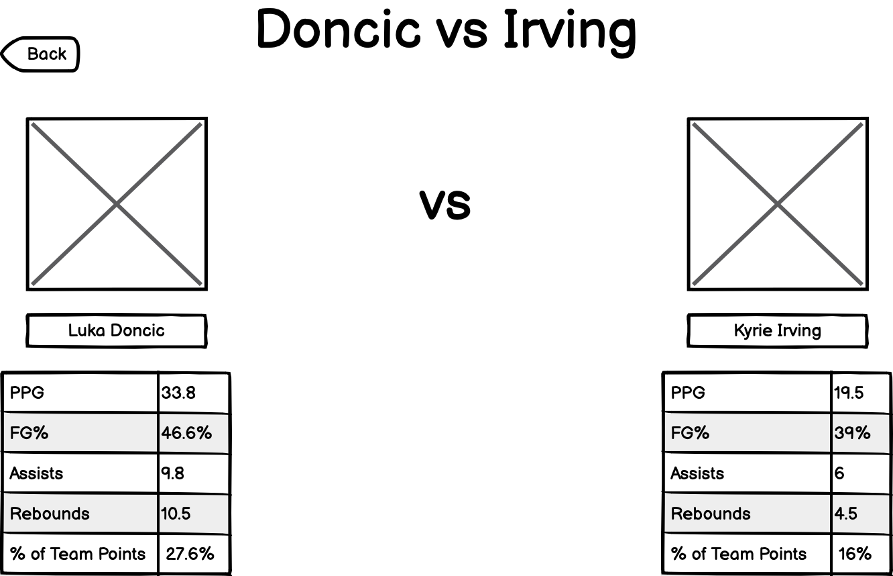
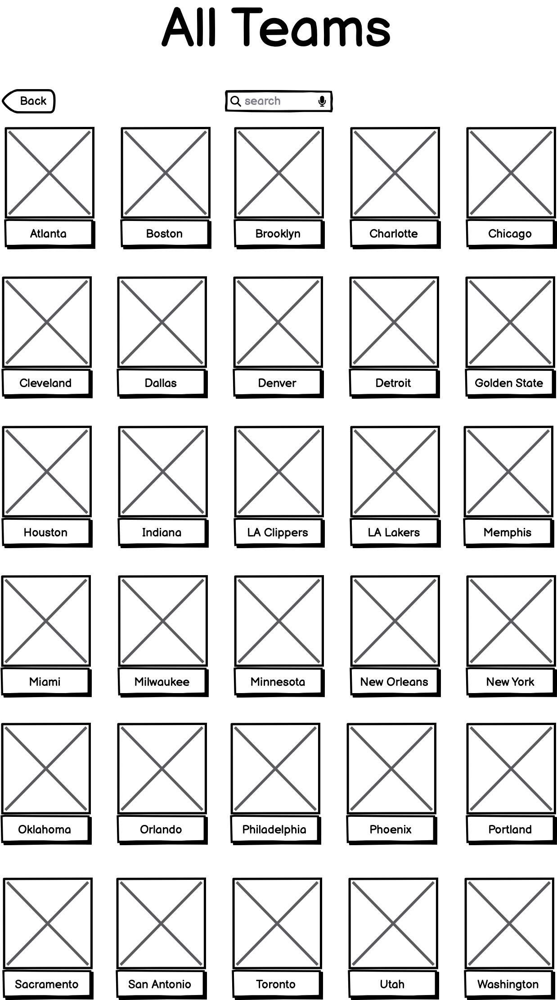
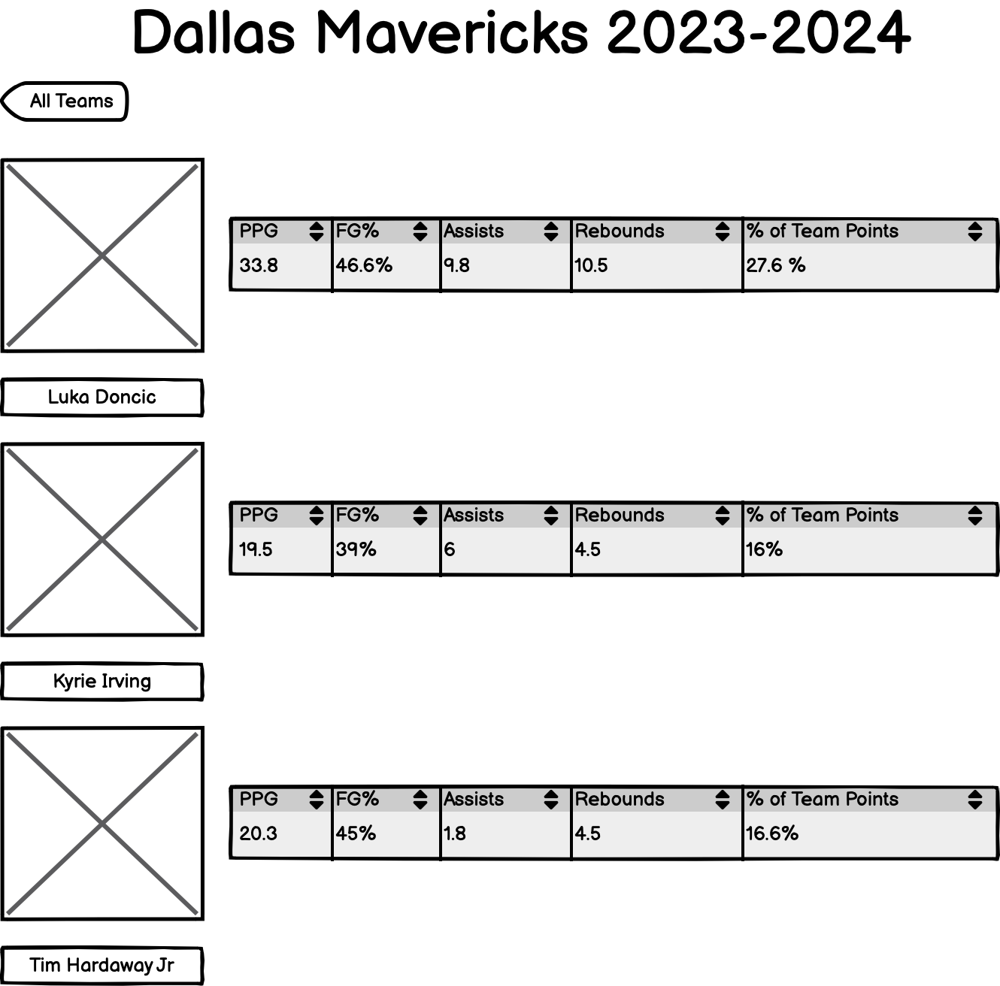

# NBA % of Team Points Calculator

## Overview

In the NBA there are many metrics used to measure player performance. The most basic statistics are things such as points, assists, rebounds, steals, and blocks, amongst a plethora of others. Without a doubt there are players who stand out on every team in different ways, and these players produce the best numbers undeniably. One can argue however that the most important statistic to a team's success is none other than the most basic one - points. As in the aim of the game in nearly every sport, the team with the most points wins.

This app introduces a new statistic to the fray of NBA statistics, letting us know the direct impact certain players have on the point total of their respective teams. In other words, the user will not only have access to all other regular statistics, but will also be able to see the percentage of a team's points can be attributed to a single player. Furthermore the user will have the abiility to create their own roster of NBA players on a singular team. By doing this, the player can use their imagination to dream up the best team possible.

## Data Model

The application will store Players, Teams, and Player Data

* teams can have multiple players (via references)
* each player can have multiple parameters (by embedding)

An Example Player:

```javascript
{
  team: "Dallas Mavericks"
  player: "Luka Doncic",
  position: "PG", "SG"
  age: 28,
  height: "6'8"
  number: 77,
  points per game: 28
  assists per game: 9
  rebounds per game: 9
  field goal percentage: 50%
  three point percentage: 40%
  steals per game: 2
  blocks per game: 1
  turnovers per game: 2
  personal fouls per game: 2.3
  +/- : 5
  
}
```

An Example List with Embedded Items:

```javascript
{
  team: "Dallas Mavericks",
  items: [
    { name: "Luka Doncic", number: 77, position: "PG", height: "6'8", ...},
    { name: "Kyrie Irving", number: 11, position: "SG", height: "6'3", ...},
  ],
  createdAt: // timestamp
}
```

## [Link to Commented First Draft Schema](db.mjs) 

## Wireframes

/list/create - page for generating a player comparison query



/list - page for showing all team



/list - page for showing all players on a team's roster



## Site map

Site map:

Home Page
- Teams
  - Player Rosters
    - Individual Player Stats
- Player Lookup
- Comparison Tool
- Filter
  - Fiter (by statistic)
  - Filter (by game)
  - Filter (by season)
- Sort
  - Sort (by statistic)

## User Stories or Use Cases

[user stories](http://en.wikipedia.org/wiki/User_story#Format) and / or [use cases](https://en.wikipedia.org/wiki/Use_case))

1. as a user, I can register on the site
2. as a user, I can log in to the site
3. as a user, I can view all teams I have created
4. as a user, I can view all the players in a team I have created
5. as a user, I can create a new player team comparison list
6. as a user, I can customize a team's name and image
7. as a user, I can add players to an existing team
8. as a user, I can remove players from an existing team
9. as a user, I can sort players by position in ascending and descending order
10. as a user, I can view player's stats over a season or a single game

## Research Topics

Unit testing with Jest
Tailwind.css as the css framework

## [Link to Initial Main Project File](app.mjs) 

## Annotations / References Used

1. [passport.js authentication docs](http://passportjs.org/docs) - (add link to source code that was based on this)
2. [tutorial on vue.js](https://vuejs.org/v2/guide/) - (add link to source code that was based on this)
